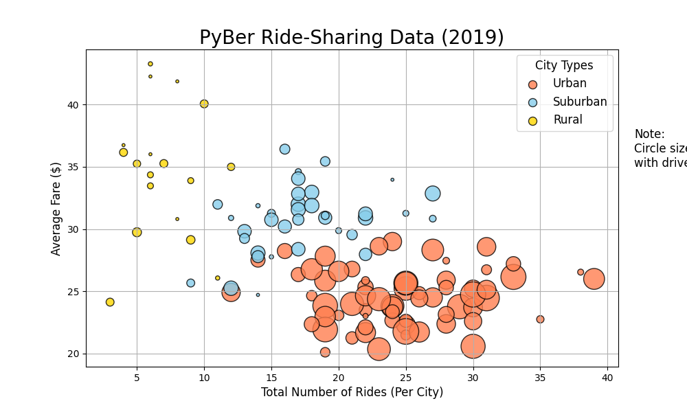
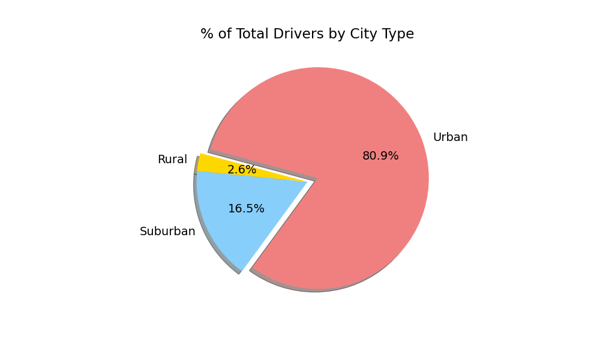
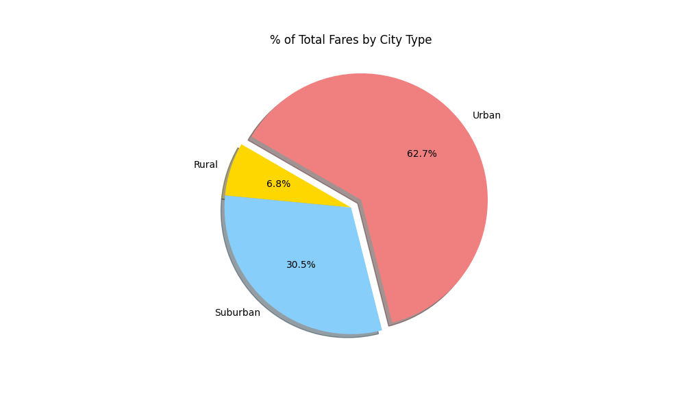

# PyBer Ride Share Analysis
### Overview
The purpose of this project is to clean, analyize and visualize this company's ride sharing data. In order to recommend a direction to make the buissiness more successful.

---

### Results

In this table it can clearly been seen that the Urban cities pull in significantly more money than the Suburban or Rural cities. 

This can be further seen by this chart

Most of the rides are in Urban cities. It is important to note that the fares are lower. The lower fares are outweighed by the sheer number of ride-share users in Urban cities. 

We can see in the folling chart that 4/5ths of our drivers are living in Urban Cities.

And in this chart we can see that nearly 2/3rs of the profit is from urban drivers.

---

## Summary
#### Buisness recommendations 

1. Exapand services in Suburban citeies.
    
    - Over 1/4 of our rides are in suburban cities. 
    - The fares are higher in Suburban cities so there is a higher profit margin
2. Rural Cities are not worth expanding serivces. 
    
    - There are just not enough customers in Rural areas to benefit the company very much from expanding there.
3. Invest in Urban cities.

    - This is where most of our riders and profit is.
    - There is clearly a customer base in urban areas and urban areas are expanding population wise. So it makes sense to market serivices there.
    - Perhaps prices could be raised in Urban cities, it would be a point for futher analysis if it would help or hinder profits. 